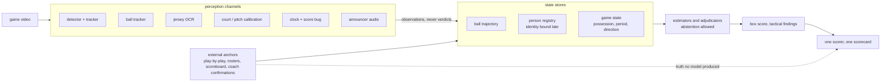
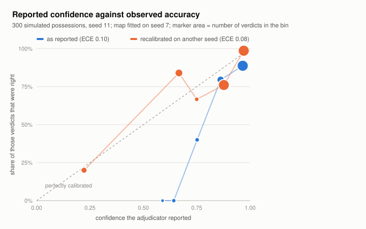
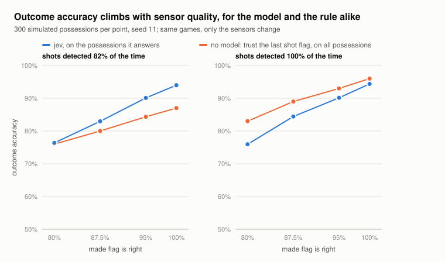

# montehall

[](https://github.com/mattwfog/montehall/actions/workflows/tests.yml)

Computer vision for team sports, built around one idea: **vision is a sensor, not
the answer**. Detectors, trackers, OCR and calibration produce observations; a
separate layer reconstructs game state from them; learned models reason over that
state. Identity is bound late, from accumulated evidence, and every capability
claim has to cite a measured result.

The argument, with measurements, is in
[Trustworthy Player Statistics from Game Video via Closed-World State Estimation](basketball/docs/cv-state-estimation-paper.md).



The repository holds two independent Python projects that apply that idea to two
sports.

| | [`basketball/`](basketball/) | [`soccer/`](soccer/) |
| --- | --- | --- |
| Package | `montehall_cv` | `soccerviz` |
| Input | fixed-camera and broadcast game film | broadcast video, provider tracking and event data |
| Core | entity-first tracklets, ball spine, person registry, shot attribution, box score | detection, pitch calibration, tracking, possession and tactics models, durable specialist harness |
| Evaluation | one scorer writes [`SCORECARD.json`](basketball/SCORECARD.json) | frozen benchmarks with tracked JSON reports in [`results/`](soccer/results/) |
| Start here | [`basketball/README.md`](basketball/README.md), [`docs/cv-brain-thesis.md`](basketball/docs/cv-brain-thesis.md) | [`soccer/README.md`](soccer/README.md), [`docs/STATUS.md`](soccer/docs/STATUS.md) |

## Shared design commitments

- **Observations, state, model.** Per-frame perception is kept separate from
  reconstructed game state, and from the models trained over that state.
- **Late-bound identity.** A track is the persistent object. Team, jersey number
  and player name are hypotheses with evidence, never stored primitives.
- **Measured claims only.** Comparisons cite a scorecard entry or a checked-in
  results file. Negative results and withdrawn recommendations stay in the record.
- **Permissive licensing by default.** Components are chosen for MIT, Apache or
  BSD terms. Exceptions are optional and listed in [`NOTICES.md`](NOTICES.md).
- **Resumable stages.** Long runs write incrementally and skip completed work.

## Models as likelihood channels

The reasoning layer follows the same rule as perception: a model is a swappable
channel, and its confidence has to be measured before it drives a decision. The
basketball possession harness ([`harness/adjudicators.py`](basketball/montehall_cv/harness/adjudicators.py))
ships two backends behind one interface:

- `generative` — one call to a generative LLM per possession; the model writes a JSON
  verdict and reports its own confidence. The model is configurable.
- `jev` — [TypeSafe's](https://docs.typesafe.ai) System One model, which generates no
  text. Code asks typed questions over the possession trace (how did it end, who
  scored, does the last pass pass the FIBA assist test, does the trace contradict
  itself) in a single request and composes the verdict from the returned
  probabilities. Abstention is a threshold, and an uncertain scorer stays a team
  stat instead of a guessed player.

[`harness/calibration.py`](basketball/montehall_cv/harness/calibration.py) scores any
backend's confidence (expected calibration error, Brier score, reliability bins,
precision-at-coverage), and `python -m montehall_cv.harness.compare` runs backends
side by side on the same traces against truth no model produced. The backends and
the scoring are tested, including a round trip through the real TypeSafe client
with the HTTP transport mocked.

A live probe ([`scripts/jev_probe.py`](basketball/scripts/jev_probe.py), six hand-built
traces, `jev-1.13.0`, 2026-09-18) is a behaviour check, not a benchmark. The model
answered all four questions for a possession in about 0.4 s and roughly 1,000 input
tokens, and its probabilities were graded rather than saturated: a clean make 1.00,
a miss followed by defensive control 0.98, a no-shot change of possession 0.81, and
a one-sample trace came back `unclear` at 0.64, so the verdict abstained. It also
failed one case: given a made shot in a possession where only the defense ever held
the ball, its self-contradiction judgment was 0.13. That contradiction is computable,
so it is now detected in code (`structural_anomalies`) and the model is only asked
for what code cannot decide.

### Scored on simulated possessions

The state simulator knows how every possession ended, so it supplies exact truth.
[`harness/sim_possessions.py`](basketball/montehall_cv/harness/sim_possessions.py) replays
sim games and hands the adjudicator the degraded trace the pipeline would see: ball
control only on ticks the ball was observed, tracker id swaps included, shots detected
82% of the time and their made flag right 87.5% of the time (the fixed-camera figures
from the paper). 300 possessions, seed 11, `jev-1.13.0`, 2026-09-18
([`results/adjudicators-sim.json`](basketball/results/adjudicators-sim.json)):

| adjudicator | answers | accuracy on what it answers | accuracy forced to answer all | ECE |
|---|---|---|---|---|
| no model: trust the last shot flag | 100% | 0.800 | 0.800 | n/a |
| jev | 61% | 0.830 | 0.800 | 0.099 |
| jev, told the sensors' error rates | 61% | 0.830 | 0.780 | 0.080 |

What the numbers say:

- **The model's outcome judgment is the rule's.** Forced to answer everything, jev
  scores 0.800, exactly the rule. On the 182 possessions jev chose to answer, the rule
  also scores 0.830. Seed 7 repeats it (0.793 against 0.797,
  [`adjudicators-sim-seed7.json`](basketball/results/adjudicators-sim-seed7.json)).
- **What the model adds is knowing when it does not know.** It abstains on 39% of
  possessions, and those are the hard ones: the rule gets only 0.75 of them right
  (0.70 on seed 7) against 0.83 to 0.86 on the rest. Within what it answers, its
  confidence ranks verdicts: precision is 0.83 at full coverage, 0.89 on its most
  confident three quarters, 1.00 on its most confident 30%. That is the abstention
  signal the identity design needs and a rule cannot give.
- **Its confidence runs high by about ten points** (mean 0.93 against 0.83 observed).
  A monotone map fitted on another seed trims calibration error from 0.10 to 0.08
  ([`adjudicators-sim-recalibration.json`](basketball/results/adjudicators-sim-recalibration.json)).
  Scorer attribution is no better than naming the last ball handler (precision 0.60
  against 0.62).

<picture>
  <source media="(prefers-color-scheme: dark)" srcset="basketball/docs/figures/adjudicator-reliability-dark.svg">
  
</picture>

Changing only the sensors, on the same games
([`adjudicators-sim-sweep.json`](basketball/results/adjudicators-sim-sweep.json)), moves
both adjudicators far more than swapping one for the other does: as the made flag
goes from 80% to 100% right, the rule climbs from 0.76 to 0.87 and jev from 0.76 to
0.94 on what it answers. With every shot detected the rule reaches 0.96; what is left
is the one case a rule cannot see, a miss, an offensive rebound, then a turnover. This
is the thesis's argument, measured: a better shot channel or an external anchor moves
the number; a smarter reader of the same evidence mostly decides which possessions to
leave alone.

<picture>
  <source media="(prefers-color-scheme: dark)" srcset="basketball/docs/figures/adjudicator-sensor-sweep-dark.svg">
  
</picture>

Limits: simulated possessions and stated noise, not real footage; one model, two
seeds, 300 possessions each; the generative backend has not been scored on this set
(`python -m montehall_cv.harness.sim_eval --backends generative jev` runs it). The
figures rebuild with `python scripts/plot_adjudicator_results.py`.

A first version of this table reported lower numbers for every row (rule 0.663, jev
0.646). The sensor sweep exposed the cause: the trace builder let the shot that ended
one possession appear as the next possession's first shot event, which capped every
score near 0.78 even with perfect sensors. It is fixed and pinned by two regression
tests in `tests/test_sim_possessions.py`.

## Running the tests

Each project is a standalone [uv](https://docs.astral.sh/uv/) project with its own
lockfile.

```sh
cd basketball && uv sync && uv run pytest -q
cd soccer && uv sync && uv run pytest -q
```

GPU work ran on an NVIDIA DGX Spark (GB10, aarch64) inside NGC PyTorch containers.
The base installs and the test suites do not need a GPU. Video, datasets and model
weights are not included in this repository.

## License

Apache-2.0, see [`LICENSE`](LICENSE). Third-party components and datasets are
listed in [`NOTICES.md`](NOTICES.md).
