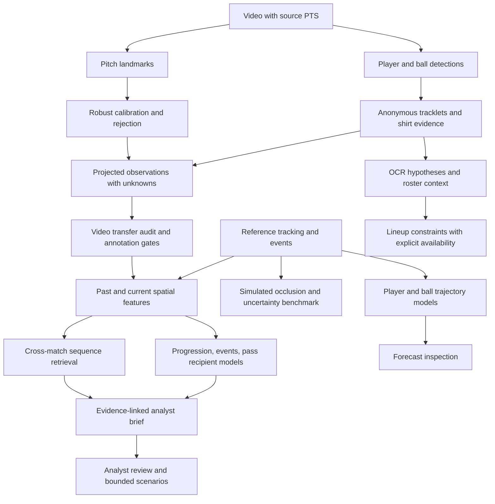

# Architecture and evidence contract

The current executable graph and migration map are in
[Unified soccer system](unified-soccer-system.md). The original scaffold contracts
below remain useful history; its dated evaluation limitations are superseded by
[Public data](public-data.md) and the unified system verification.

The system keeps observations, reconstructed state, predictive outputs, and
managerial hypotheses separate. This follows the useful parts of Montehall's
evidence model without inheriting basketball geometry or five-player constraints.

The video-to-feature arrow is presently a diagnostic path. Unresolved possession,
direction, identity, geometry and domain calibration prevent it from driving
validated tactical recommendations or silently joining training data.

## Persisted contracts

| Artifact | Meaning | Must not be treated as |
| --- | --- | --- |
| `frames.parquet` | Source ordinal, PTS/time base, timestamp, cut hypothesis | Invented constant-frame-rate source timing |
| `detections.parquet` | Box/category/confidence with unique evidence ID; derived track/team attributes in explicit columns | Ground truth or named player identity |
| `primitive-evidence.parquet` | Detection evidence only; excludes track/team/tactical verdicts | A container for downstream model labels |
| `landmarks.parquet` / `calibration.parquet` | Predicted keypoints, accepted/rejected fit, matrix and residual diagnostics | Independently measured physical-position accuracy |
| `state.parquet` | Projected observation or hypothesis, unavailable coordinates, calibration status | Filled-in player positions or known possession |
| `jersey/observations.parquet` | OCR tokens, confidence and detection references | Verified jersey/name assignment |
| `uncertainty/reconstructed-state.parquet` | Observed / estimated / unavailable, age and empirical radius | Observed off-screen truth |
| `samples.parquet` | Causal spatial features and separate future target | Unrestricted feature input including future labels |
| `tactics/*.parquet` | Model outputs, descriptive proxies, ranked alternatives, cross-match neighbors | Causal tactical effects or expert judgments |
| `reviews.sqlite` | Append-only analyst judgments | Automatically curated training/evaluation labels |

Each completed video run includes a source/checkpoint hash report and a stage
manifest with Parquet hashes and row counts. The runner does not overwrite
completed runs. Failed/incomplete runs lack their completion report. Raw provider
CSV and demo assets are pinned by hashes. The workbench checks reference sample
and trajectory artifact compatibility before displaying them.

The code validates increasing timestamps, unique evidence IDs, frame foreign
keys, finite projected coordinates, and calibration acceptance. Missing or
ambiguous evidence produces explicit unavailable/abstain states. A track ID is
anonymous continuity, not a jersey number, roster slot, or tactical role.

## Evaluation separation

Game 1 and game 2 remain disjoint. Formation fits, pressure, phase and lane
simulation outputs are descriptive proxies; the next-event, shot-surrogate,
recipient-ranking and trajectory outputs have measured development baselines.
Neither category substitutes for analyst tactical labels or causal validation.

Video annotation exports contain **unreviewed suggestions** and empty ground
truth fields. The evaluator only accepts explicitly reviewed frames from the
same video hash. It reports class-aware precision/recall at an IoU threshold,
not COCO mAP, HOTA or an invented tracking score. Full benchmark integrations
remain a next step once labeled video is available.

The first manager brief is deterministic text assembled from measured records.
It does not require an LLM, invent unavailable context, or execute team decisions.
Lineup assignment only optimizes supplied scores with explicit availability;
the provided unknown-context template correctly abstains.

## Experiment operation

`soccerviz research` regenerates local tactical, occlusion, geometry, identity,
actor and managerial reports and audits the prepared demo. Spark scripts run
the heavier video and neural experiments in separate temporary containers.
`soccerviz inventory` records which component reports actually exist; an absent
report is marked not run. Optional stages never report fabricated performance.

Current limits include one development evaluation match, a single 20-second
video example, heuristic cut detection and tracking, no independent jersey or
pitch labels, and simplified pass physics. There is no multi-camera fusion,
3D ball reconstruction, joint diffusion response model, or validated coaching
intervention system yet. Those are later model replacements/extensions, not
hidden claims made by the initial scaffold.
