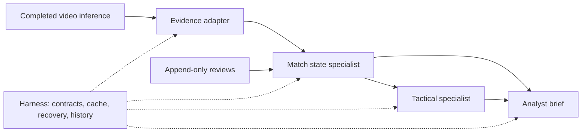

# SoccerViz specialist harness

Updated 2026-09-07: the [unified colony](unified-soccer-system.md) expands the
four-stage flow below into ten video specialists or five provider specialists,
including independent checks. The persistence/review contract remains; the
earlier diagram and four-stage examples describe the original slice.

This is the first working slice of the siphonophore architecture: cooperating
specialists share immutable evidence and versioned state through a durable local
runtime. It runs a short video window through evidence, state reconstruction,
tactical findings, and an inspectable possession brief.



## Boundaries and contracts

The adapter consumes the existing `soccerviz video` / Spark video outputs. GPU
inference remains outside the checkpointed graph for this milestone. Import
freezes selected records, source and model hashes, and file hashes inside SQLite.
Later changes to the original Parquet files cannot change that run. Video pixels
remain at their source; the database stores evidence and derived records.

Specialists declare a name, version, dependencies, output schema, resource class,
and evaluation criterion. Implementation/module hashes, declared helper hashes,
and relevant library versions join the input and parent artifact IDs in the
cache key. Changes to the shared specialist module conservatively invalidate
all four specialists. A single specialist version change invalidates that stage
and its descendants. Resource and evaluation descriptions are metadata;
the executor runs CPU functions synchronously, with schema checks and regression
tests enforcing the current contracts.

## Start, pause, resume, and inspect

From the repository root, after creating the demo video artifacts:

```sh
uv run soccerviz harness start \
  --video-run artifacts/video/demo-v2 --start-s 10 --end-s 20 --max-stages 2
```

The command prints a run ID before execution. It deliberately pauses after two
newly executed specialists; cached stages do not consume that budget. Replace
`RUN_ID` below with the printed ID:

```sh
uv run soccerviz harness resume RUN_ID
uv run soccerviz harness inspect RUN_ID
uv run soccerviz harness export RUN_ID
```

Export produces `brief.md`, `run.json`, and every referenced JSON artifact,
including parent lineage and frozen input. The path includes the run ID, review
revision, and result-manifest fingerprint. Earlier exports remain available
after corrections or code changes. To use a separate store, put it before the
operation: `harness --store artifacts/harness-lab resume RUN_ID`.

## Reviewed corrections

A correction is an explicit assertion with a reviewer, reason, supporting
evidence IDs, and an effective source-time interval. It does not automatically
become training or evaluation ground truth. Use evidence and tracklet IDs from
the exported artifacts. This is a template, not a verified demo annotation:

```json
{
  "field": "team",
  "tracklet_id": 1,
  "value": 1,
  "start_s": 10.0,
  "end_s": 11.0,
  "reviewer": "REPLACE_WITH_REVIEWER",
  "reason": "REPLACE_WITH_OBSERVED_EVIDENCE",
  "evidence_ids": ["REPLACE_WITH_DETECTION_ID"]
}
```

```sh
uv run soccerviz harness review RUN_ID --file correction.json
uv run soccerviz harness export RUN_ID
uv run soccerviz harness export RUN_ID --revision 0
```

Supported fields: `team` and `identity` for a `tracklet_id`, `orientation` for a
`team_cluster`, and `possession` for the interval. Teams are anonymous clusters
0/1; orientation is -1/+1; identity is a supplied string. A null value returns
the selection to unknown. It does not delete earlier assertions. The latest
applicable review is selected while all alternatives remain in the state.

Intervals use source PTS seconds and exclude their endpoint. Review timestamps
record when the system learned the assertion. `--revision 0` cannot see later
corrections, even if they refer to earlier video time. This is retrospective
window analysis; it does not reproduce when the upstream detector learned
every fact. Reviewed context can inform later analysis while primitive records
stay immutable.

## Persistence and recovery

- SQLite transactions commit an immutable content-addressed output and completed
  attempt together. Partial output cannot become a cache hit.
- The execution lock releases on process death. The next executor marks abandoned
  attempts interrupted and retries them. Ordinary failures retain their errors;
  `resume` retries them without an unbounded automatic retry loop.
- A correction reuses evidence and recomputes state, tactics, and the brief.
- Each execution rebuilds the current result view from verified cache entries.
  A downstream failure cannot expose an old brief beside a new state.
- SQLite triggers prevent updates/deletes to objects and reviews. Artifact hashes
  are checked on read. Attempts preserve older outputs after code changes.
- One executor runs per store on one host. Reviews may be appended concurrently;
  execution stays pinned to the revision selected at its start.
- Specialist functions should be deterministic and free of external side effects.
  Future GPU/network workers need idempotent job adapters; this runtime does not
  promise exactly-once external actions.

## Current evidence gates

All ball candidates are retained. A frame gets a possession hypothesis only
with one candidate and visible players from both teams, when the nearest team
is within 2.5m and closer than the other team by more than 0.75m. These are
development heuristics, not calibrated probabilities. A possession review can
override the selected team.

Unknown frames, camera cuts, and source-time gaps break candidate possessions.
The brief selects the candidate with the most supporting sampled frames. Its
first and last observations are not confirmed possession boundaries.

Rejected/missing calibration blocks projected positions. At least seven visible
players on the selected team are needed for its 10th–90th percentile width/depth.
Unknown attacking direction generates a review request. Detector confidence is
separate from positional uncertainty, which remains unknown. Physical accuracy
and tactical transfer remain unvalidated, so this slice abstains from coaching
recommendations.

## Verification and next adapters

`tests/test_harness.py` covers process termination/recovery, checkpoint reuse,
dependent invalidation, preserved alternatives, old-revision replay, evidence
clocks, frozen imports, immutable records, ambiguity, calibration failures,
camera/time gaps, version changes, executor exclusion, and stale brief prevention.
Test corrections are synthetic; no human annotation of the demo is claimed.

Next adapters: GPU inference under a resumable job contract, measured identity
and possession quality from reviewed footage, and review requests in the
workbench. Forecasts and learned tactical scores can join once their input
contracts represent video uncertainty. Existing provider-tracking experiments
continue alongside this first migration.
