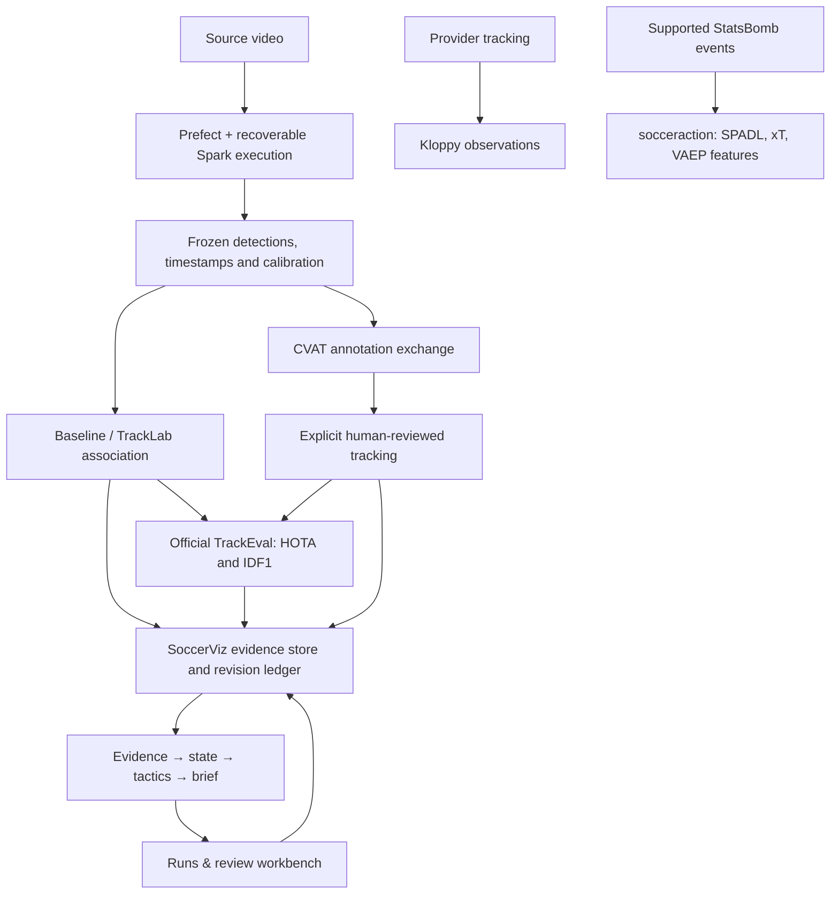

# Reusable specialists and the shared harness

SoccerViz now has runnable adapters for CVAT, official TrackEval, TrackLab's
OC-SORT, Kloppy, socceraction, and Prefect. The Gradio workbench includes a
**Runs & review** tab for inspecting a run, applying contextual corrections,
replaying revisions, and exporting the brief with its evidence.

The siphonophore idea is implemented as specialists sharing one evidence store
and review history. Each specialist has a bounded job; the harness owns source
identity, dependencies, versions, and the resulting match-state revision.
Optional libraries run in separate processes where their dependencies conflict.



Kloppy and action-value outputs currently remain separate research artifacts;
they do not silently replace reconstructed video state. Tracker outputs enter a
new harness run. CVAT imports and evaluation reports attach to the selected run.
The adapters are deterministic library workers, not autonomous language-model
agents. A future reasoning specialist can use the same evidence contract without
owning a second copy of match truth.

## Install and run

From the repository root:

```sh
uv sync --locked --python 3.12
.venv/bin/python scripts/setup/setup_integrations.py all
.venv/bin/soccerviz workbench --port 7866
```

Open http://127.0.0.1:7866. The setup creates four persistent worker environments:

| Environment | Upstream components | Why separate |
| --- | --- | --- |
| `.venvs/analysis` | TrackLab 1.3.24, Kloppy 3.19.0, socceraction 1.5.3 | socceraction requires NumPy below 2; core requires NumPy 2 |
| `.venvs/evaluation` | Official TrackEval commit `12c8791b303e0a0b50f753af204249e622d0281a` | Pin the evaluated upstream implementation and metric compatibility |
| `.venvs/execution` | Prefect 3.8.5 | Keep remote orchestration dependencies independent of the workbench |
| `.venvs/soccernet` | Official SoccerNet TrackEval fork, pinned source | GS-HOTA benchmark evaluation without replacing standard TrackEval |

Requirements pin the tested direct dependencies. The analysis runtime inventory
records its complete observed installation; these are tested environments, not a
claim of identical transitive resolution on every platform. TrackLab is installed
without its full application's dependency bundle because only its OC-SORT plugin
is used. The core environment stays managed by `uv.lock`.

The unified entry point is `.venv/bin/soccerviz integrations --help`. Worker
interpreters must retain their virtual-environment path; the launcher deliberately
does not dereference Python's executable symlink.

## A video review and comparison

```sh
.venv/bin/soccerviz harness start \
  --video-run artifacts/video/demo-v2 --start-s 10 --end-s 20
# Use the printed RUN_ID below.
.venv/bin/soccerviz integrations cvat-export RUN_ID \
  --out artifacts/cvat/new-review
.venv/bin/soccerviz integrations track \
  --video-run artifacts/video/demo-v2 \
  --out artifacts/integrations/new-comparison \
  --python .venvs/analysis/bin/python
```

Review the original footage in CVAT, then export its edited XML and complete the
review sidecar. Follow the [annotation guide](../experiments/annotation-evaluation.md) for exact
frame mapping and exhaustive review requirements. Suggested boxes are never
accepted as ground truth just because they were exported.

```sh
.venv/bin/soccerviz integrations cvat-import RUN_ID \
  --xml reviewed.xml --manifest artifacts/cvat/new-review/manifest.json \
  --review review.json --out reviewed-tracking.json --preview
# Remove --preview to apply the reviewed import.
.venv/bin/soccerviz integrations evaluate RUN_ID \
  --reviewed reviewed-tracking.json --out tracking-report.json \
  --python .venvs/evaluation/bin/python
```

The evaluator defaults to the run's frozen predictions. Alternative predictions
must carry the same video hash; see the adapter guides for their JSON shape.
Use identical reviewed frames and frozen detections to compare associations.
Each comparison backend writes a ready-to-use `predictions.json`; pass, for
example, `--predictions artifacts/integrations/new-comparison/tracklab-ocsort/predictions.json`
to `evaluate`. The baseline export is in the adjacent `soccerviz` directory.
Image-space box corrections support tracking metrics; re-projecting those
corrections into metric pitch geometry remains a separate step.

Contextual reviews use atomic, idempotent batches and reject a stale starting
revision. Old hypotheses remain inspectable. Attachments carry their own
`created_at` and attached revision, and remain visible in later revisions. The
state's `known_at` clock refers to contextual reviews; it is not an as-of filter
for reports attached later. Exports include those distinctions and all referenced
immutable JSON objects.

## What has actually run

| Component | Verification | Interpretation |
| --- | --- | --- |
| CVAT exchange | Exported 2,318 suggestions across 100 demo frames; synthetic reviewed import/retry/rejection tests | Real human annotation still needed; no CVAT service deployed |
| TrackEval | Official HOTA/Identity tested against perfect, switched, missed and empty-frame fixtures; dispatched through the isolated runtime | Metric adapter works; no real-video accuracy claim |
| TrackLab | Both backends associated the same 2,318 real frozen detections | Baseline: 43 tracklets; OC-SORT: 457. Retain OC-SORT as an experiment |
| Kloppy | 500 real Metrica frames, 28 registered players, 3,182 missing positions preserved | Provider conversion preserves the source clock and missingness |
| socceraction | 2,206 training actions from Turkey–Italy; 1,953 held-out actions from Denmark–Finland; 1,476 movements rated | xT fit/rate works; value accuracy is unmeasured and VAEP classifier is untrained |
| Prefect / Spark | Real one-second GPU video job, two frames, 48 detections, ten hash-verified outputs; fresh-process resume reused the same execution | Recovery and retrieval smoke passed; persistent worker supervision remains a deployment task |

The tracker replay removes appearance features from both backends because frozen
artifacts do not contain the original color vectors. Fragmentation counts alone
do not establish identity accuracy. One training match also cannot establish
useful tactical valuation.

Detailed commands and evidence:

- [Data, tracking and action-value adapters](data-tracking-adapters.md)
- [Annotation and tracking evaluation](../experiments/annotation-evaluation.md)
- [Recoverable remote execution](remote-execution.md)
- [Real xT report](../../results/experiments/statsbomb-xt-report.json)
- [Real Spark execution report](../../results/experiments/spark-execution-report.json)
- [Frozen tracker comparison report](../../results/experiments/tracker-comparison-report.json)
- [Combined verification record](../../results/experiments/integration-verification.json)
- [Harness contracts and recovery](harness.md)

## Next evidence gate

The [public-data pipeline](public-data.md) now supplies SoccerNet annotations and
measured tracker comparisons, expanded StatsBomb training, and SkillCorner data.
The earlier table records the first integration milestone. Current priorities
are calibration coverage, jersey/team outputs, and broader official validation
coverage. Use CVAT for specific footage gaps and deployment-transfer checks.

Upstreams: [CVAT](https://github.com/cvat-ai/cvat),
[TrackEval](https://github.com/JonathonLuiten/TrackEval),
[TrackLab](https://github.com/TrackingLaboratory/tracklab),
[Kloppy](https://github.com/PySport/kloppy),
[socceraction](https://github.com/ML-KULeuven/socceraction),
[Prefect](https://github.com/PrefectHQ/prefect).
