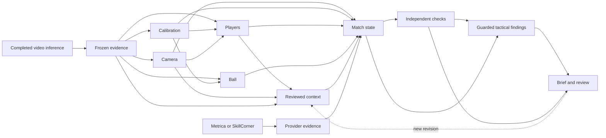

# Unified soccer system

Implemented 2026-09-07 in the existing SoccerViz project. The basketball project supplied the
organism/colony precedent. This is an executable research
system, not a claim that perception or counterfactual coaching is solved.

## One runtime and one state contract



Both input paths write `match-state/v1` and use the same checks, tactical
consumer, review history and export. Each run uses one source: matching schemas
do not establish that unrelated datasets describe the same match or share
synchronized coordinates.

`colony_runtime.build_colony` is the executable declaration. `ColonyRegistry`
validates dependencies and cycles and derives execution order. Its manifest is
stored immutably and drives the workbench stage display. Video executes ten
specialists; provider tracking executes five. Optional unavailable specialists
must declare their absent behavior. A missing required artifact blocks
execution; a present artifact can explicitly contain no observations so state
remains unknown.

The video organs transform frozen inference outputs into separate channels.
GPU extraction still runs through the existing Spark job adapter before import;
this change does not retrain or replace its detector, tracker or calibration.

## State and evidence semantics

- Each video channel carries source clocks, evidence IDs, hypotheses,
  model/input provenance and present/empty/missing coverage.
- Video entity IDs use source + camera shot + track. A reused tracker number
  after a cut does not inherit an earlier-shot identity review without evidence
  from that shot. Permanent cross-cut identity is still unsolved.
- Provider IDs are not verified names. Detected, extrapolated, unknown-detection
  and unavailable states remain distinguishable. Only observed/detected provider
  positions count in visible-team shape or proximity possession inference.
- SkillCorner keeps frame time separate from its possibly null match clock.
  Centered coordinates translate to zero origin using reported pitch dimensions;
  original coordinates, translation and source-axis orientation remain recorded.
  Metrica keeps its existing adapter's assumed 105-by-68-metre convention.
- Detector scores never become positional uncertainty or possession probability.
  Reviews retain alternative assertions, author, evidence and effective time;
  they do not automatically become training/evaluation truth.
- State composition is currently deterministic, including the existing proximity
  possession heuristic. This is the interface for a future joint estimator,
  not a learned posterior over all player/ball trajectories.

## Checks, recovery and acceptance

Checks cover duplicate identities/tracklets, clocks/source alignment, invalid
geometry, calibration use, possession support, orientation and discontinuities.
Each records what it checked and skipped. Structural violations block affected
frames from tactical findings; boundary flags prevent bridging discontinuities.
The original evidence and state artifacts remain unchanged.

The existing SQLite store, immutable objects, content-based cache, process lock,
review revisions and interrupted-stage recovery remain. Optional absence/presence
participates in cache keys. Context corrections reuse observation organs while
context, state and downstream consumers rerun.

`experiment_gates` separates execution completion from scientific acceptance.
An acceptance contract contains exact report/source/version hashes and explicit
numeric criteria. The evaluator compares actual report fields to those criteria;
an agent's `complete` string is insufficient. No thresholds or model promotion
were invented for this integration.

The registry is an **inference execution graph**. Numeric acceptance exists, but
the persistent autonomous train/evaluate/select-next-version agent supervisor
has not been ported. The bounded components built so far are distinct from an
operating training-loop supervisor.

## Reuse and migration coverage

| Existing layer | Treatment |
|---|---|
| Montehall registry/dependency contracts | Adapted into executable declarations shared by runtime and display. |
| Montehall iteration supervisor | Not ported. Numeric acceptance exists; durable autonomous training loops remain. |
| Montehall stage writer/markers | Replaced by SoccerViz immutable snapshots and content invalidation; channel census added. |
| Montehall checker ownership/coverage | Adapted into soccer consistency artifacts and an active tactical gate. |
| Montehall token/state separation | Adapted into observation channels and shared state; no GRU weights copied. |
| Montehall person registry/lineup solver | Not ported; basketball constraints and reviewed defects preclude direct reuse. |
| Montehall court/rim/shot/scoreboard/audio | Basketball-specific outputs skipped; new soccer audio/OCR channels still need contracts. |
| SoccerViz video inference/Spark jobs | Retained; completed outputs feed video evidence. |
| SoccerViz harness/review | Retained and extended to registry and provider input. |
| Metrica/Kloppy and SkillCorner | Existing import artifacts now enter the same state/checks/brief flow. |
| CVAT, SoccerNet, TrackEval | Retained with source/split isolation and separate benchmark records. Consistency is not accuracy. |
| StatsBomb SPADL/xT/VAEP | Retained as isolated training/evaluation; never silently aligned with unrelated tracking/video. |
| Forecasts/pass options/retrieval/manager experiments | Retained in the workbench; adapting them to consume shared state is the next product milestone. |
| Dataset catalog/workbench | Retained. Runs & review accepts both source paths and exposes organs/diagnostics. |

## Run and inspect

Verified commands on 2026-09-07 use existing local artifacts:

```sh
.venv/bin/python -m soccerviz.cli.main harness registry
.venv/bin/python -m soccerviz.cli.main harness registry --provider
.venv/bin/python -m soccerviz.cli.main harness start \
  --provider-run artifacts/integrations/kloppy-game1 --start-s 0 --end-s 10
```

**Runs & review → Start an analysis from existing data** accepts existing video
or provider imports. The selected run shows its brief, specialists, observations,
channel coverage and check report. Corrections and evidence downloads use the
same revision workflow.

`harness assess RUN --report FILE [--contract FILE]` freezes a source-matched
measurement and attaches its decision. Contract report hashes are canonical JSON
object hashes, not file-byte hashes. Existing benchmark reports can remain
immutable and be referenced from a separate `acceptance-evidence/v1` envelope
with explicit source/version provenance. Acceptance applies to those criteria
and that report; it does not certify the whole system or promote a model.

## Finishing sequence

1. **One pass-option workbench on provider tracking.** Adapt existing pass
   generation, trajectory forecasts, retrieval and value models to shared state.
   Show actual action, alternatives, joint continuations, outcome distributions
   and comparable evidence. Current simulations are baselines, not causal effects.
2. **Improve video organs under frozen evaluation.** Calibration coverage/error,
   identity continuity and ball/possession are immediate bottlenecks. Report
   component accuracy and complete-sequence coverage beside downstream metrics.
3. **Learn joint state.** Preserve competing assignments and positions over time,
   including off-screen uncertainty. Evaluate identity precision/coverage and
   uncertainty calibration; confidence alone cannot establish quality.
4. **Connect the development supervisor.** One bounded experiment per
   specialist/version, immutable measurements, explicit targets, dependency
   readiness, budgets and version selection. Never promote on self-report.

The frontier is action-conditioned responses of both teams and the ball, and
evidence that recommendations help decisions. Infrastructure completion and
predictive plausibility do not establish that quality by themselves.

## Verification

Actual runs are recorded in `results/experiments/unified-colony-verification.json`.
The unchanged-model video sample still abstains from possession analysis;
Metrica/SkillCorner samples yield descriptive findings from observed positions.
All three report partial consistency coverage because some state is unknown.
These are integration results, not new perception benchmarks.
